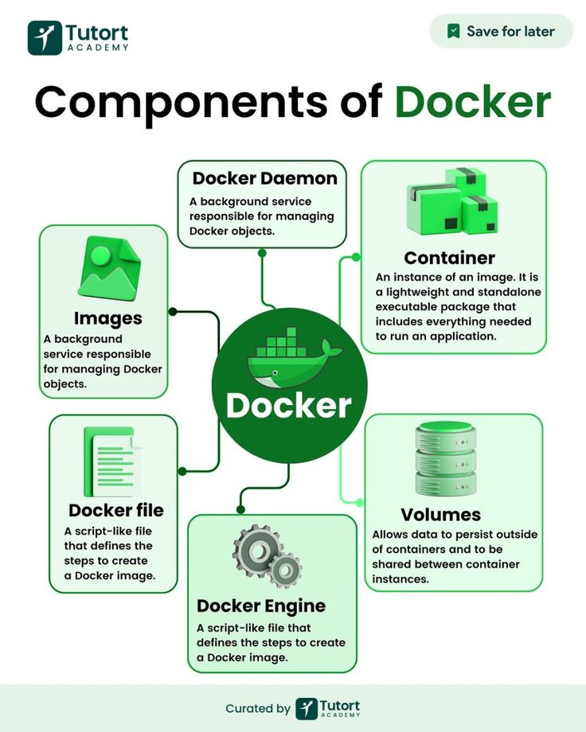
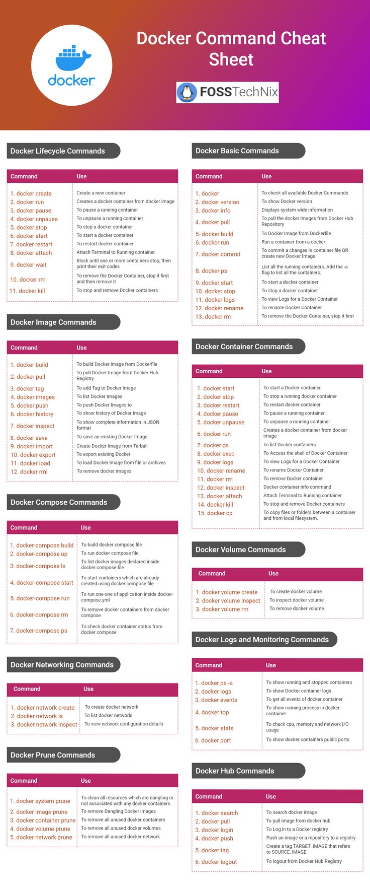
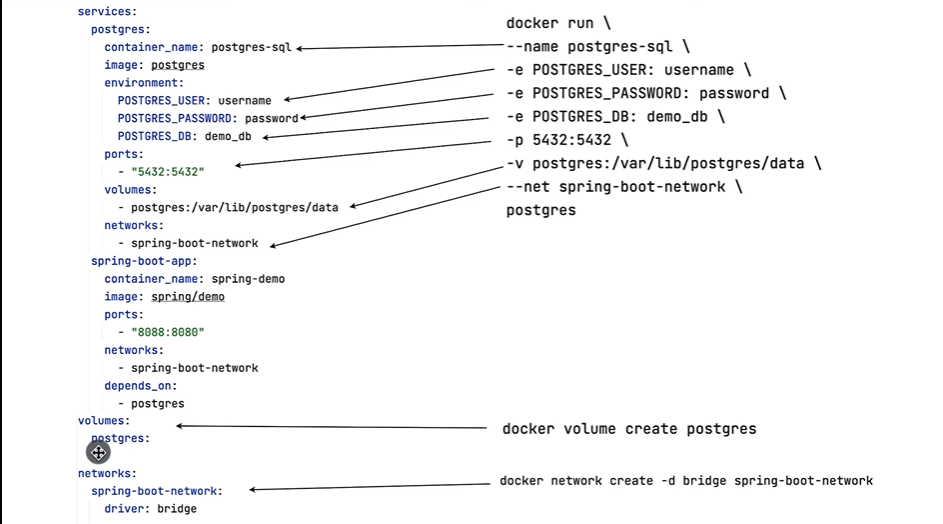

# 🐳 Docker Essentials Guide

Starting implementing Docker — creating Dockerfile to build Spring Boot application image and Docker Compose file for multi-container setup (volume, images, network, etc.)
Quick reference for Docker commands and workflows — from basic operations to multi-container setups.

---

## 🔐 Authentication
```bash

docker login -u your-username
🖼️ Image Management

# Pull image
docker pull <image-name>

# List images
docker images

# Remove image
docker rmi <image-id>
🚀 Container Operations
Basic Execution

docker run <image-name>
docker run -d <image-name>  # Detached mode
Environment Variables

docker run -e POSTGRES_PASSWORD=password postgres
Named Containers

docker run --name mycontainer -e POSTGRES_PASSWORD=password postgres
PostgreSQL Setup

docker run -d \
  --name postgres-sql \
  -e POSTGRES_USER=postgres \
  -e POSTGRES_PASSWORD=root \
  -e POSTGRES_DB=demo_db \
  -p 5432:5432 \
  -v postgres_data:/var/lib/postgresql/data \
  --network spring-boot-net \
  postgres
📦 Container Management

# List running containers
docker ps

# List all containers (including stopped)
docker ps -a

# Stop container
docker stop <container-id>

# Start container
docker start <container-id>

# Remove container
docker rm <container-id>

# View logs
docker logs <container-name>
docker logs -f <container-name>  # Follow live logs
🛠️ Image Building

# Build image from Dockerfile in current directory
docker build .

# Build image with a tag
docker build -t spring/test .

# Run container from custom image
docker run <repository-name>
🌐 Networking

# List networks
docker network ls

# Create a new network
docker network create <network-name>

# Remove a network
docker network rm <network-name>

# Connect container to network
docker network connect <network-name> <container-name>

# Inspect network details
docker network inspect <network-name>

# Run container with specific network and port mapping
docker run --net <network-name> -p 8080:8080 <image-name>
🐳 Docker Compose

# Start services (foreground)
docker compose up

# Start services (detached)
docker compose up -d

# Stop and remove services and networks
docker compose down
🐘 Database Interactions

# Access PostgreSQL container's psql shell
docker exec -it postgres-sql psql -U postgres

# Useful psql commands inside container
\l                # List databases
create database <db-name>;
exit
🛠️ Build Tools

# Create a JAR package using Maven Wrapper
./mvnw clean package
💡 Pro Tips
Always specify explicit image versions in production (avoid using latest tag)

Use volumes for data persistence

Regularly clean unused containers and images (docker system prune)

Use .dockerignore to exclude unnecessary files and speed up builds
```
---
📊 Visual References

---

---

---

## 🔑 Key Differences Between Dockerfile and Docker Compose

| **Feature**     | **Dockerfile**                                      | **Docker Compose**                                     |
|-----------------|-----------------------------------------------------|--------------------------------------------------------|
| **Purpose**     | Defines how to build a Docker image                 | Defines and manages multi-container applications       |
| **File Type**   | Text file                                           | YAML file (`docker-compose.yml`)                       |
| **Scope**       | Single image                                        | Multiple containers (application stack)                |
| **Usage**       | Used to create Docker images                        | Used to run and manage containers                      |
| **Build Context** | Defines the context for building an image        | Can specify a build context including a Dockerfile     |

---


